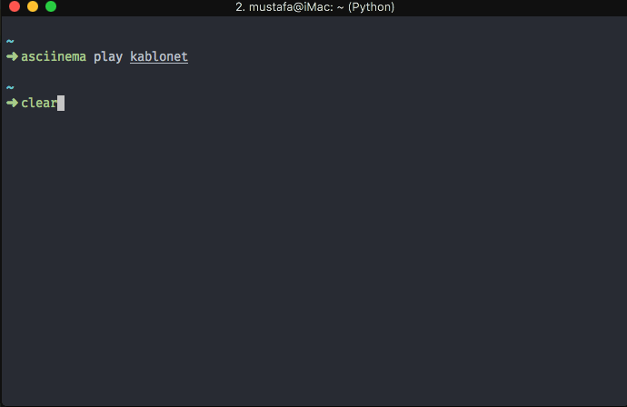

# Kablonet CLI 
[](https://travis-ci.org/tosbaha/kablonet) [](http://codecov.io/github/tosbaha/kablonet)
=========

This utility allows you to check Kablonet for different services.

## Services
- Borc
- Kota
- Detayli Kota
- Kampanyalar
- Hizmetler

## Screenshot


## Demo


## Installation
You can globally install this module and use it directly. When you first run the module, it will ask you your Musteri No and password. They will be stored in your computer and won't be asked next time. If you make a mistake, you can change your credentials by running `kablonet login` 

## Security
Your musterino and password is saved locally. Only MD5 hash of password is saved. Even though MD5 is a weak hash, there is no point of saving the key with another encryption. Since this application is open source, everybody can get the key and decrypt it.

## Tests
In order to run tests, you need to set `musterino` and `password` environment variables correctly. You can rename `.env.example` file to `.env` to run the tests.

```
musterino=Your MusteriID
password=MD5 hash of your real password 
```

You can calculate MD5 of your password with the following command

```bash
echo -n myPassW0rd | md5
```

## Author
Mustafa Dur

## License
This code is distributed under the terms and conditions of the [MIT license](https://raw.githubusercontent.com/tosbaha/kablonet/master/LICENSE).
